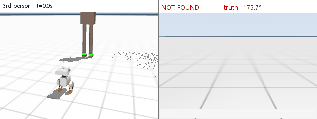

# Open Duck Mini v2 — Reinforcement Learning for a 42 cm Biped

A PPO walking policy for the open-source [Open Duck Mini v2](https://github.com/apirrone/Open_Duck_Mini),
trained in **MuJoCo Playground (JAX / MJX)** for 300 M environment steps on the University of Seoul
**UBAI** SLURM cluster (RTX 3090, 1 h 11 min, 68,700 steps/s) — with a **get-up task built from
scratch** that does not exist upstream, and **four upstream bug fixes** published as a
[public fork](https://github.com/soyeon24/Open_Duck_Playground/tree/standup-task-and-fixes).



*Given a start and a goal, with no keyboard input: the robot turns on the spot until the person's
ankle bands enter its head camera, walks over, and stops. Started here facing away from the goal.
Left is a chase view, right is what the head camera sees.*

## Headline result — the sim-to-real gap, measured before ordering a single part

MuJoCo's actuator `forcerange` allows **±3.23 N·m** per joint. A real STS3215 stalls at **1.86 N·m**,
and the knee sits on that ceiling **14–16 %** of the time. Derating the model to the real limit never
made a trained policy fall — it only cost speed (−42 % / −69 %). Retraining with the ceiling *set* to
the real limit changed exactly one variable and more than doubled walking speed under it:

| Policy | Trained with `forcerange` | Speed at the real 1.86 N·m limit |
|---|---|---|
| `hw8` | ±3.23 N·m (simulator default) | 0.057 m/s |
| `fr186` | ±1.86 N·m (real servo stall torque) | **0.130 m/s** |

Neither ever fell. Handed back the ±3.23 clamp it was never trained on, `fr186` reaches only 0.136 —
it never learned to spend torque the hardware does not have. Its mean checkpoint reward is 6 % *lower*
than `hw8`, which is a reminder that reward across two differently clamped models is not a comparison
worth making. The follow-up run randomizes the ceiling per joint over U(1.40, 1.90) so the policy is
not tuned to a single operating point the hardware will rarely sit on.

**Hardware status: no parts ordered yet.** This measurement is what unblocks the order — printing and
assembly follow, then sim-to-real tuning. Everything reported here is simulation.

> **The detailed engineering notes — [`NEXT_STEPS.md`](NEXT_STEPS.md), [`SIM_NOTES.md`](SIM_NOTES.md),
> [`HARDWARE_PREP.md`](HARDWARE_PREP.md) — are written in Korean.** This README, the repository
> structure and the fork's commit history are in English.

---

## Upstream bugs found and fixed

Published in the [fork](https://github.com/soyeon24/Open_Duck_Playground/tree/standup-task-and-fixes),
not in this repository.

| # | Upstream bug | File | Fix |
|---|---|---|---|
| 1 | `get_gravity` uses the sensor **id** as a `sensordata` address, so it reads `local_linvel` instead of `upvector` — gravity reads near zero whether the robot is upright or inverted | `mujoco_infer_base.py` | [`c8eed76`](https://github.com/soyeon24/Open_Duck_Playground/commit/c8eed76) |
| 2 | The ONNX session opens a thread per core and busy-waits between calls, so a 0.03 ms inference pegs 16 cores — viewer CPU **98 % → 3.6 %** | `onnx_infer.py` | [`7d6cadb`](https://github.com/soyeon24/Open_Duck_Playground/commit/7d6cadb) |
| 3 | The `head_pos` reward exists but is never registered, so head commands are silently ignored; `stand_still` then fights it, pulling the head home while `head_pos` pulls it to the command | `rewards.py`, `joystick.py` | [`51d4212`](https://github.com/soyeon24/Open_Duck_Playground/commit/51d4212) |
| 4 | Command ranges do not match the reference motion — 48 % of the forward range is unreachable and `dy` is 80 % wider than the reference, so `tracking_lin_vel` and `imitation` pull against each other across that band | `joystick.py` | [`51d4212`](https://github.com/soyeon24/Open_Duck_Playground/commit/51d4212) |

Two further upstream defects are diagnosed but **not** fixed: `--restore_checkpoint_path` cannot reload
what `policy_params_fn` writes (which caps a run at 48 h), and `--task rough_terrain` points at an XML
that does not exist. Findings 4 and 5 in [`SIM_NOTES.md`](SIM_NOTES.md).

New work in the same fork: [`f1ba3d8`](https://github.com/soyeon24/Open_Duck_Playground/commit/f1ba3d8)
the get-up task, [`4a05ccb`](https://github.com/soyeon24/Open_Duck_Playground/commit/4a05ccb) the viewer
(full reset, direct head control, dance moves).

---

> ### Two ducks, one folder
> The folder is named `Microduck` for historical reasons, but the actual build target is the
> **42 cm [Open Duck Mini v2](https://github.com/apirrone/Open_Duck_Mini)** — *not* Pollen
> Robotics' 25 cm Microduck. When the two get mixed up, read **[`ROBOTS.md`](ROBOTS.md)**:
> it is a one-screen card telling them apart, including the parts that look alike
> (Pi Zero 2 W vs Pico 2 W, STS3215 vs ST3215, 626ZZ vs 608ZZ).

Why not Microduck: its mechanical STLs and MJCF *are* published under Apache-2.0, and its
compute board is an off-the-shelf Radxa Zero 3W — but there is no BOM, no wiring diagram, no
assembly guide, and no schematic or gerber for its custom HAT PCB, so it cannot be self-built.
Full evidence in [`microduck_ref/README.md`](microduck_ref/README.md).

---

## Walking to a goal on its own

The walking policy was not retrained for this. Perception sits **outside** the policy — it produces
the same three velocity numbers an arrow key would, and the policy cannot tell where they came from.
A head camera finds the person's fluorescent ankle bands by hue, and the bearing to them drives the
yaw command directly.

Given a start and a goal the robot runs three phases: **turn on the spot** until the bands appear in
frame (three frames running, so a glint does not count), **walk**, and **stop** within 0.55 m.
The heading is re-measured from the camera every control step at 50 Hz, not integrated from the IMU —
so shoving the robot mid-walk is corrected on the next frame rather than accumulating.

Scored by [`eval_goto.py`](eval_goto.py), which drives the same `goto_step` the viewer's N key runs,
on an obstacle-free scene:

| Condition | Result |
|---|---|
| Four start headings (0 / 90 / 180 / −90°) | **4 / 4 arrived**, 14.0–19.0 s end to end |
| Eight uniformly random start headings | **8 / 8 arrived** |
| A second goal at (−1.20, 1.50) | **3 / 3 arrived** |
| Trunk rotated ±90 / 150 / 180° mid-walk | **4 / 4 re-acquired** in 1.7–5.0 s, all still arrived |

Nothing fell in any run (minimum gravity-`up` 0.991–0.996).

Two bugs surfaced while measuring this, both older than the feature:

- **The yaw command has a dead zone.** Turning in place at 0.35 moves the robot 0–4 °/s; it takes
  0.8 to get 25–29 °/s. The lost-target search had been set to 0.35, so it had never actually
  turned to search for anything. Small yaw commands *while walking forward* are unaffected.
- **The camera's range estimate cannot decide arrival.** It comes from the pixel width of the two
  ankle bands merged, so an oblique view inflates it — 2.18 m read at a true 1.92 m, 8.48 m when
  the blob is clipped at the frame edge — and inside 0.4 m the bands fall below the field of view
  entirely. The robot walked straight past the person. Arrival now triggers on whichever of the
  camera range and the goal coordinate lands first; either one alone deadlocks.

Obstacles are deliberately absent here. Reactive avoidance is a separate problem, and mixing it in
makes a failure unattributable to either layer.

---

## Repository layout

| Path | Contents |
|---|---|
| `README.md` | This file. The map. |
| `ROBOTS.md` | **42 cm vs 25 cm — which duck is which.** Read when the two get confused. (Korean) |
| `BOM.md` | **The shopping list.** One page, checkboxes, exact part specs, what not to buy. Take it to the checkout. (Korean) |
| `HARDWARE_PREP.md` | Ordering, BOM, assembly pitfalls, printing, vision plan. Everything about parts. (Korean) |
| `NEXT_STEPS.md` | Plan, decision log, hardware specs, cluster access. **Read this first when resuming.** (Korean) |
| `SIM_NOTES.md` | Detailed simulation notes — standup task, head-tracking problem, findings 1–5. (Korean) |
| `ubai/` | SLURM scripts for the UBAI supercomputer, plus the local measurement probes (`head_probe2.py`, `torque_probe.py`, `torque_derate_test.py`). Procedure in `ubai/README.md`. (Korean) |
| `ubai_standup/` | sbatch script for standup training |
| `from_ubai/` | 9 trained ONNX policies retrieved from the cluster |
| `print/` | 36 STL types (51 parts) for 3D printing + `PRINT_CHECKLIST.md` |
| `microduck_ref/` | Research record on Pollen's Microduck (25 cm) — **the robot this project does not build.** Kept as the reasoning behind the choice. (Korean) |
| `make_standup_xml.py` | Generates the standup training XML (adds ground collision boxes) |
| `smoke_standup.py` | Local CPU sanity check for the standup env (not training — a pre-flight check) |

Two paths referenced below are **not** in this repository:

- **`Open_Duck_Playground/`** — the RL training environment. It lives in a separate
  [fork of `apirrone/Open_Duck_Playground`](https://github.com/soyeon24/Open_Duck_Playground)
  (branch `standup-task-and-fixes`); see *Attribution & License* below. Clone it next to this repo.
- **`BEST_WALK_ONNX_2.onnx`** — the community-validated walking policy used as a baseline.
  Not redistributed here (see below). Obtain it from
  [Open_Duck_Mini_Runtime](https://github.com/apirrone/Open_Duck_Mini_Runtime) or the project Discord.

---

## Split workflow — campus vs. home

There is no local GPU (Intel Iris Xe), so training runs on the **UBAI SLURM cluster at the
University of Seoul**. The UBAI gateway sits on a private IP and there is no VPN, so it is
**reachable only from the campus network**.

| Where | What |
|---|---|
| **Campus** | Submit training with `sbatch`, retrieve result ONNX files via `scp` |
| **Home** | Prepare code and scripts, replay and analyze retrieved policies on local CPU |

Hence the rhythm: **queue up a batch on each campus visit, collect it on the next one.**
An `ssh` timeout from home is expected behavior, not a fault.

> Acknowledgement required for any publication using these resources:
> "The authors acknowledge the Urban Big data and AI Institute of the University of Seoul
> supercomputing resources (http://ubai.uos.ac.kr) made available for conducting the research
> reported in this paper."

---

## Quick start — watch a policy run

```
cd <repo_parent>\Open_Duck_Playground
set PYTHONPATH=<repo_parent>\Open_Duck_Playground
..\.venv\Scripts\python.exe -u -m playground.open_duck_mini_v2.mujoco_infer -o ..\BEST_WALK_ONNX_2.onnx
```

For standup policies, point at the scene that has torso collision geometry:
`--model_path playground\open_duck_mini_v2\xmls\scene_standup.xml`

### Controls (code comments assume AZERTY; these are the actual keys)

| Key | Action |
|---|---|
| ↑ ↓ | Forward / backward |
| ← → | Strafe left / right |
| Q / E | Turn left / right |
| P / ; | Gait frequency ±0.1 |
| **R** | **Full reset** (added by this project. Do not use Backspace — it falls over instantly) |
| 1–5 / 0 | Five dance moves / stop |
| T | Toggle direct head control |
| **N** | **Walk to the goal by itself** — turn until the person is found, go, stop |
| F | Follow the person (the `go` half of N, without the search) |
| V / G | Toggle obstacle avoidance / head tracking |

Commands latch until changed. The viewer window must have focus.

---

## Two Python environments — do not mix them

| | Purpose | Versions |
|---|---|---|
| `.venv` | **Inference and viewer only** | jax 0.11.1 / mujoco 3.12.0 / playground 0.2.0 |
| `.venv-train-cpu` | **Local validation of training code** (matches the cluster) | jax 0.6.2 / mujoco 3.3.4 / playground 0.0.5 |

`joystick.py` and `standup.py` cannot be imported under `.venv`
(`mujoco_playground._src.collision` was removed in playground 0.1.0).
Inference only needs onnxruntime, so it runs fine on the newer stack.

---

## Done so far

- [x] Simulation environment set up; walking confirmed with the community policy
- [x] UBAI cluster access, environment install, GPU training pipeline (`ubai/`)
- [x] **Completed a 300M-step walking run** — 1 h 11 min, 68,700 steps/s (RTX 3090)
- [x] **Designed a get-up task from scratch** — not present upstream. Iterated v1 → v4
- [x] **Scored those policies instead of trusting the reward curve, and found they do not work.**
      All three succeed 0/8 past a 45° start. The training reward hid it completely: the
      highest-reward run was no better than the lowest, because over 70 % of the reward on
      offer was collectable by lying still (60 of a possible 260 per episode). Two design
      faults — the start poses were not the curriculum they looked like (every tilt from 90°
      to 160° settles into the *same* pose, and 180° is a headstand no fallen robot is ever
      in), and every reward term except `upright` was gated on being upright, so the entire
      first half of getting up paid nothing. Both fixed; retraining as job 984812
- [x] Viewer improvements — R-key reset, CPU usage 98% → 3.6%, five dance moves
- [x] **Closed the loop from camera to gait** — start-to-goal navigation with no keyboard input,
      8/8 from random start headings and 4/4 recoveries from being rotated mid-walk. No retraining:
      perception feeds the same three velocity commands a keypress would
- [x] **Fixed four upstream bugs** and diagnosed two more — table at the top of this file
- [x] Collected 51 STL parts + print plan (PLA 990 g + TPU 34 g, Bambu H2D/X1C)
- [x] **Measured actuator torque headroom before committing to the parts order** — the sim
      allows ±3.23 N·m per joint but a real STS3215 stalls at 1.86 N·m. The knee sits on that
      clamp 14–16 % of the time, yet derating the model to the real limit never made either
      policy fall; it only cost speed (−42 % / −69 %). The measurement outlived the build it was
      for: it is why training now pins `forcerange` to the real limit

## Next

- [ ] Compare the three walking + head-tracking policies in the viewer — all three jobs
      (910949 / 910953 / 910954) completed and were retrieved into `from_ubai/` on 2026-09-06.
      Note the final 300M checkpoint scored *lower* than the 279M one in all three runs, so both
      were kept; the gap is within one reward std, so the viewer has to settle it
- [ ] Retrieve job 973253 (`checkpoints_frr`, submitted 2026-09-12): same run again but with the
      torque ceiling randomized per joint over U(1.40, 1.90) instead of pinned at 1.86. Derating
      `fr186` below its training limit costs 15 % at 1.71 N·m (a sagging 6.8 V pack) and 34 % at
      1.50 (a hot servo), so the policy is tuned to one point the hardware will rarely sit on.
      Four more runs went out with it: two other band widths (1.55–1.90, 1.25–2.00), a seed
      replicate to tell a real gap from seed noise, and the same band on rough terrain
- [x] **Answered whether getting up is physically possible at all** (no arms — it might not have
      been). Optimised an open-loop joint trajectory with CEM under the real servo speed and
      torque limits: from flat on its back it reaches a crouch (torso 0.85 upright, 10.6 cm of
      a standing 15 cm) and holds it, so physics is not the blocker. It does not reach a full
      stand open-loop, and handing off to the walking policy fails on all 256 candidates —
      balance needs feedback, which is what the policy is for. Recovery from the headstand
      remains unverified
- [ ] Rate the get-up policy at the real 1.86 N·m limit — the get-up scene still runs at 3.23
- [x] **Retrained one 300 M run with `forcerange` at the real servo limit (1.86 N·m)** — job
      972703, RTX 3090, 1 h 17 min. Only the backlash model's clamp changed, so it differs from
      the `hw8` run by exactly one variable
- [x] **It buys the speed back.** Under the real 1.86 N·m limit the new policy walks 0.130 m/s
      against `hw8`'s 0.057, and neither ever fell. Given the same 3.23 clamp it was trained
      without, it only reaches 0.136 — it never learned to spend torque the hardware does not
      have. Mean checkpoint reward is 6 % *lower* than `hw8`, which is a reminder that reward
      across two differently clamped models is not a comparison worth making
- [ ] Fix `--restore_checkpoint_path` — needed for runs longer than 48 h

**The physical build is not being pursued.** The work below the line — 51 STL parts, the print
plan, the BOM, the torque-headroom measurement — was done to the point where the parts order was
the next step, and that is where it stops. It is kept here as a record, not as a plan; the torque
work in particular is the reason the walking policy is trained against the real servo limit rather
than the simulator default, so it earned its place in the sim results whether or not anything is
ever printed. Effort goes to simulation: the get-up task, MuJoCo, and the training pipeline.

---

## Changes made to upstream `Open_Duck_Playground`

These live in the fork, not in this repository. Originals are kept as `.orig` backups locally.

| File | Change |
|---|---|
| `mujoco_infer.py` | R-key full reset, `viewer.sync` cadence, dance moves, direct head control |
| `onnx_infer.py` | onnxruntime single-threaded, spin-wait disabled (fixes CPU pegging) |
| `mujoco_infer_base.py` | Fix `get_gravity` sensor address bug |
| `rewards.py` | Add `only_when_moving` flag to `cost_head_pos` |
| `joystick.py` | Register the `head_pos` reward, align command ranges with the reference motion |
| `standup.py` (new) | Standup task. Subclasses `Joystick`, so the observation layout matches and existing viewers can replay it |
| `standup_runner.py` (new) | Standup training entry point (kept separate so `runner.py` stays untouched) |
| `*_standup.xml` (new) | Model + scene with ground collision boxes |

Rationale and dead ends are documented in `SIM_NOTES.md`.

---

## Attribution & License

This repository contains **two kinds of material**, licensed differently.

### 1. Original work — this project

`ubai/`, `ubai_standup/`, `make_standup_xml.py`, `smoke_standup.py`,
`NEXT_STEPS.md`, `SIM_NOTES.md`, `print/PRINT_CHECKLIST.md`, this README, and the
trained policies in `from_ubai/` are the author's own work.

### 2. Third-party material

| Material | Origin | License |
|---|---|---|
| `print/*.stl`, `print/print_guide_original.md` | [apirrone/Open_Duck_Mini](https://github.com/apirrone/Open_Duck_Mini) (v2 branch) | **Apache-2.0** — see [`print/LICENSE`](print/LICENSE) and [`print/NOTICE.md`](print/NOTICE.md) |
| Training code (in the separate fork) | [apirrone/Open_Duck_Playground](https://github.com/apirrone/Open_Duck_Playground) | See note below |

**Note on the training code.** `apirrone/Open_Duck_Playground` publishes **no LICENSE file**.
Individual files derived from [google-deepmind/mujoco_playground](https://github.com/google-deepmind/mujoco_playground)
(`joystick.py`, `standing.py`, `base.py`, `constants.py`, `randomize.py`) do carry
Apache-2.0 headers, and modifications to those files are marked in place as Apache-2.0 §4(b)
requires. The remaining files carry no license grant. For that reason the modified training
code is published **as a GitHub fork of the upstream repository** rather than copied into this
repository — forking is explicitly permitted by the GitHub Terms of Service (D.5) — and
`BEST_WALK_ONNX_2.onnx` is **not redistributed** here.

If you are the upstream author and would like anything here changed or removed, please open an issue.

---

## Links

- Main repo (hardware / CAD): https://github.com/apirrone/Open_Duck_Mini — **v2 branch**
- Training: https://github.com/apirrone/Open_Duck_Playground
- On-robot runtime: https://github.com/apirrone/Open_Duck_Mini_Runtime
- Reference motion generation: https://github.com/apirrone/Open_Duck_reference_motion_generator
- Korean overview: https://robotics.growbotics.ai/ko/projects/hardware/open-duck-mini-v2
- Discord: https://discord.gg/UtJZsgfQGe
